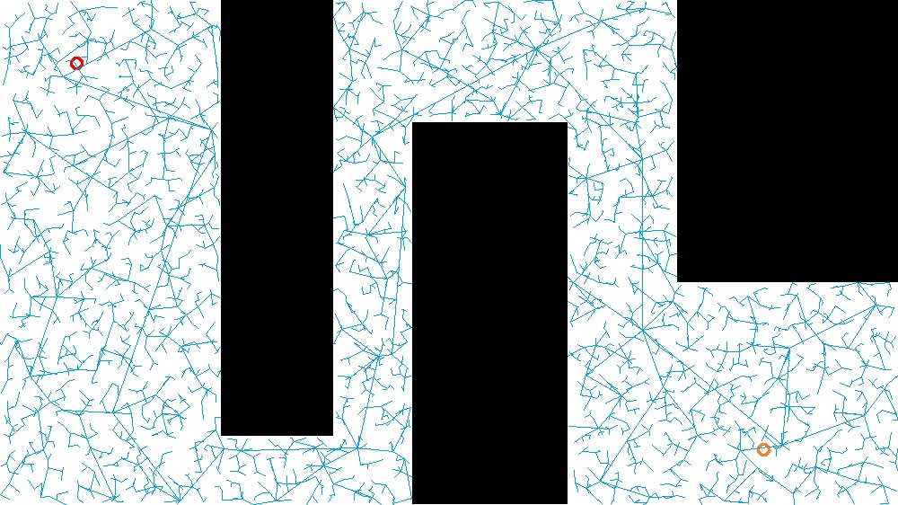
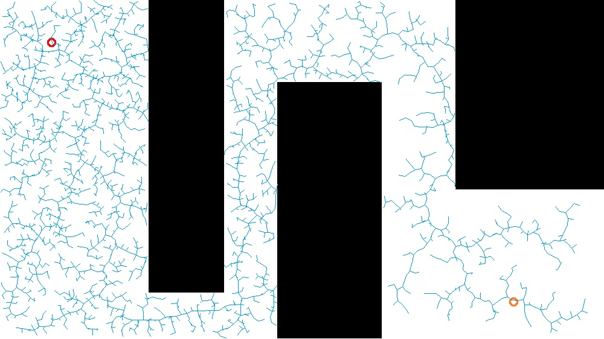

#Searching Algorithms
Following searching algorithms are implemented in this projects:  
-BFS 
-Dynamic Programing
-A* ,2D(x,y) and 3D(x,y,theta)  
-RRT Using Vehicle Dynamic Model,5D(x,y,theta,speed,steering speed)  
  
  
Here are the test results.  
##Comparison of BFS, DP, A* 
In real life,situation is more complicated.For example,if we are heading to a place in rush hour and we need to go through a traffic light.Then perhaps we don't want to take a left turn because it's gonna wait for 5 minutes.Instead we may want to take a detour,which is faster then taking a left turn.This problem can be solved by adding a third dimension,which is orientation factor.Consider the following example:  
start(4,2)  
target(0,0)  
{1, 0, 1, 1, 1},  
{1, 0, 1, 0, 1},  
{1, 1, 1, 1, 1},  
{0, 0, 1, 0, 0},  
{0, 0, 1, 0, 0},	 
    
Using three dimensional(x,y,orientation) A* we can get the following path:  
Search effort: 1  
Shortest path:14  
  
Where  
'T' is target  
'#' is obstacle  
"^,>,V,<" are trajectories  
'+' is an overlap of trajectories  
  
  
##RRT
Basic RRT  
  
  
  
  

  
RRT Searching with Smooth Path     
  
  
RRT Searching with Smooth Path and Obstacle Avoidance  
  
  
RRT Searching Using Vehicle Dynamic Model  
  
  
  
  
  
  
  
