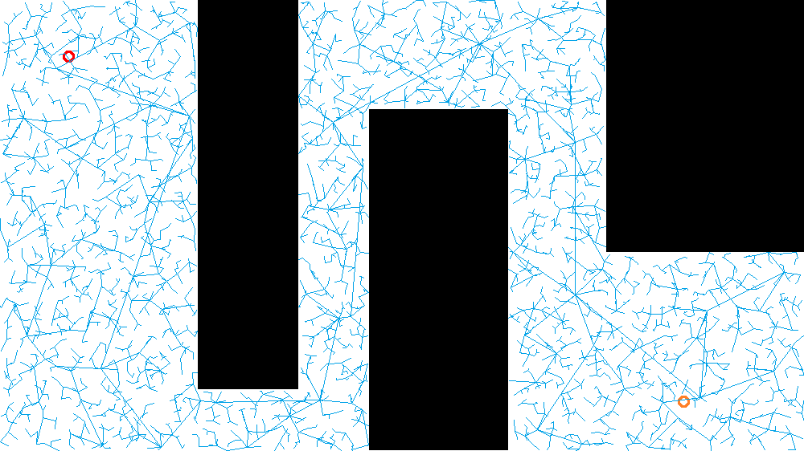
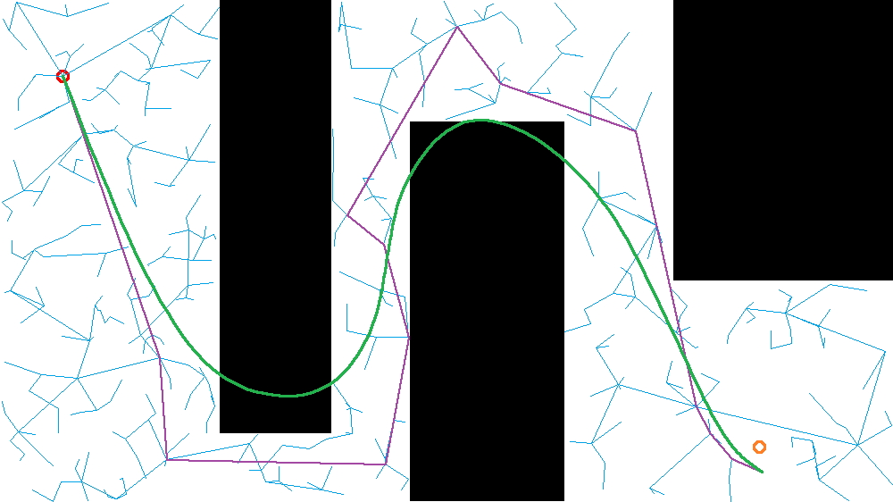

#Searching Algorithms
Following searching algorithms are implemented in this projects:  
-BFS 
-Dynamic Programing
-A* ,2D(x,y) and 3D(x,y,theta)  
-RRT Using Vehicle Dynamic Model,5D(x,y,theta,speed,steering speed)  
  
  
Here are the test results.  
##Comparison of BFS, DP, A* 
  
  
##RRT
Basic RRT  
  
  
  
RRT Searching with Smooth Path     
  
  
RRT Searching with Smooth Path and Obstacle Avoidance  
  
  
RRT Searching Using Vehicle Dynamic Model  
  
  
  
